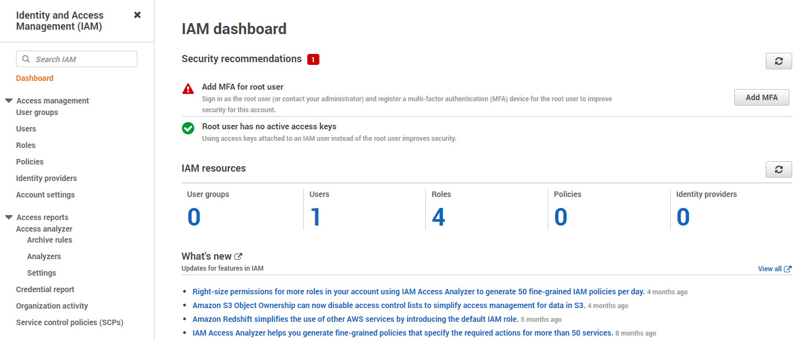
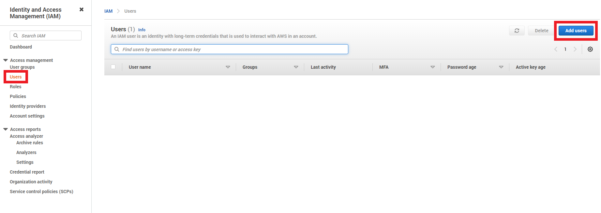
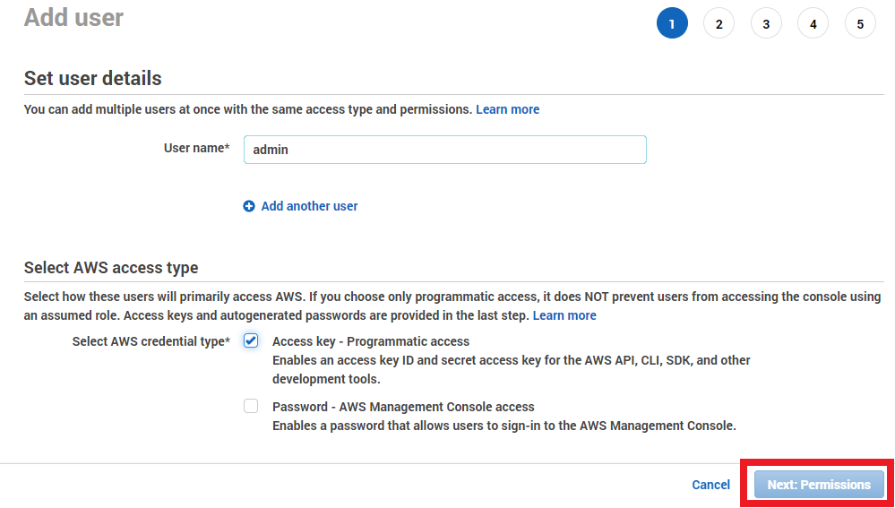
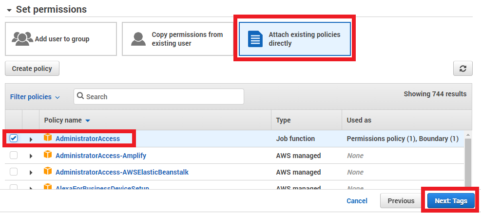
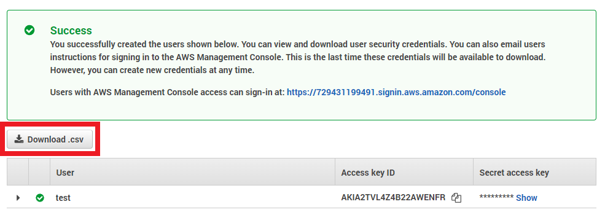
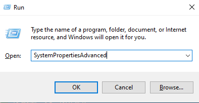
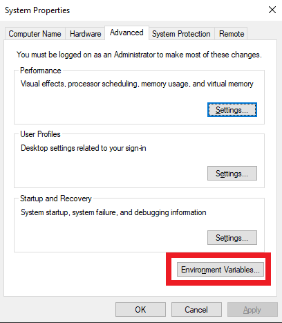
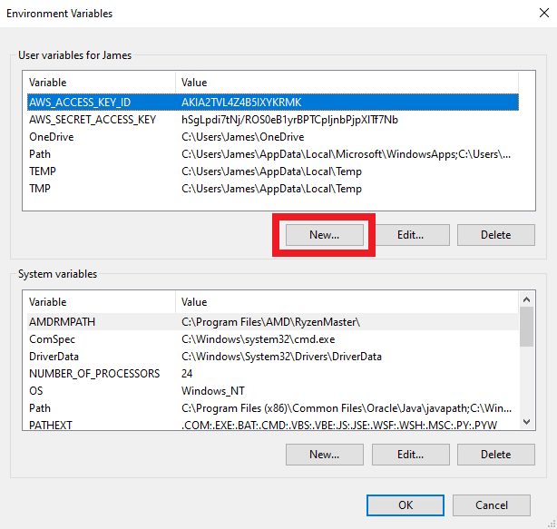
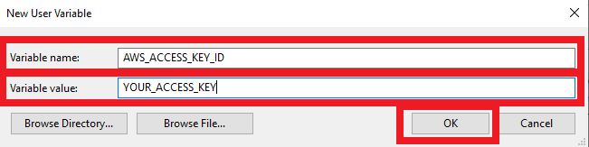

1. Log in to your Amazon AWS account that you created in the previous step.

2. navigate to the IAM console. You can get there by typing in "IAM" into the Search for Services bar, or by following [this link](https://us-east-1.console.aws.amazon.com/iamv2/home)



3. Create a new User by navigating to the "Users" tab and clicking "Add users"



4. Enter a Username of "admin" and check the box for Access Key credentials, then click Next



5. navigate to "Attach existing policies directly", check the AdministratorAccess policy and click Next



6. Assign no tags - click Next

7. Review - click Create User

8. click Download .csv. This file will contain your Access key ID and Secret access key. IT IS IMPORTANT TO SAVE THESE. They will be used in the next step.



9. Set up your environment variables

    - Linux: 

        1. Run the following in shell:

        ```export AWS_ACCESS_KEY_ID="YOUR_ACCESS_KEY_HERE"```
        ```export AWS_SECRET_ACCESS_KEY="YOUR_SECRET_ACCESS_KEY_HERE"```


     - Windows: 

        1. Push Win+R

        2. type SystemPropertiesAdvanced into the box and push Enter
        
        

        3. click "Environment Variables" at the bottom

        

        4. Under "User varibales for {YOUR_USER}", click "New"

        

        5. Create an entry with the Variable Name of AWS_ACCESS_KEY_ID with a Variable Value of {YOUR_ACCESS_KEY}

        

        6. Create another entry with the Variable Name of AWS_SECRET_ACCESS_KEY with a Variable Value of {YOUR_SECRET_ACCESS_KEY}

        7. Create a final entry with the Variable Name of AWS_DEFAULT_REGION with a Variable Value of us-east-1